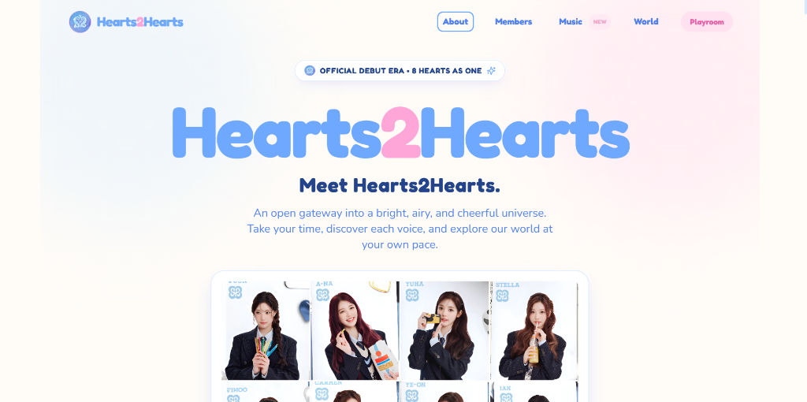

# 💖 Hearts2Hearts (하츠투하츠) — Interactive Showcase & Fan Universe

<div align="center">

[](https://h2immerse.vercel.app)
[](https://nextjs.org)
[](https://react.dev)
[](https://www.typescriptlang.org)
[](https://tailwindcss.com)
[](https://www.framer.com/motion)

**An immersive, cheerful, daylight-aesthetic web introduction to SM Entertainment's 8-member global girl group, Hearts2Hearts (하츠투하츠).**

[Explore Live Showcase 🌐](https://h2immerse.vercel.app) • [View Repository 📁](https://github.com/Kh1zZ/h2h-interactivelp)

---



</div>

---

## 🌟 Overview

**Hearts2Hearts (하츠투하츠)** is an eight-member girl group under **SM Entertainment**, debuting on **24 February 2025** with their breakthrough single album *The Chase*. 

This project is an interactive, fan-crafted multimedia landing page engineered to deliver an authentic daylight pop atmosphere with pastel aesthetic harmony, butter-smooth scroll motion, high-definition audio previews, and interactive fandom experiences.

### 🔗 Live Deployment
- **Production URL**: **[https://h2immerse.vercel.app](https://h2immerse.vercel.app)**
- **Deploy Platform**: Vercel (Edge-optimized static generation)

---

## ✨ Key Features & Scene Chapters

### 🌸 Scene 0: Sunshine Sky Opening (Hero)
- Grand airy daylight wordmark with smooth scaling on scroll.
- High-definition official group visual portrait.
- Non-intrusive ambient background glow calibrated to SM daylight pop palette (`#FFFCF8`, `#6FA8FF`, `#FFA6D9`).

### 📖 Scene 1: The Cheerful Hello (About & Agency Story)
- Introduction to Hearts2Hearts' musical identity and group genesis.
- Exclusive **SM Entertainment & SM 3.0** multi-production center legacy spotlight.
- Symmetrical candy stat badges highlighting 8 members, debut date, *The Chase*, and fandom **S2U**.

### 💫 Scene 2: Eight Hearts (1-by-1 Fullscreen Member Spotlight)
- Dedicated stage for each of the 8 members:
  - **Jiwoo** (Leader, Bunny 🐰)
  - **Carmen** (Cat 🐱, Indonesia 🇮🇩)
  - **Yuha** (Bear 🐻)
  - **Stella** (Canada 🇨🇦)
  - **Juun** (Star ⭐️)
  - **A-na** (Fox 🦊)
  - **Ian** (Visual Aura)
  - **Ye-on** (Maknae, Swan 🦢)
- Rich member cards with personal symbols, hangul names, zodiac, MBTI, role cues, and member lore.

### 💿 Scene 3: Discography (Spinning Pastel Turntable)
- Interactive vinyl turntable with real-time record swapping and rotation effects.
- Full release timeline from *The Chase*, *STYLE*, *FOCUS*, *RUDE!*, *Lemon Tang*, to Japan debut *Iconic Heart*.
- High-fidelity audio sample playback for previewing tracks.

### 🚗 Scene 3.5: Latest Single Spotlight (*MOONRIDE* × Kia Korea)
- Dedicated showcase for the latest electropop drop **"MOONRIDE"** (9 September 2026).
- Official collaboration with **Kia Korea** for the Kia RV "Black Edition" campaign.
- Integrated minimalist 20-second audio preview bar with time progress and mute toggle.

### 🎨 Scene 4: Concept Lore & Aesthetic Universe
- Three narrative pillars: **The Chase** (Narrative Lore), **Daylight Pastel** (Visual Identity), and **S2U** (Fandom Galaxy).
- Official Debut Era concept visual staging featuring the brand new debut photo.
- **720p HD Debut Trailer Player**: Muted auto-looping teaser with direct one-click redirect to the full official trailer on [YouTube](https://www.youtube.com/watch?v=srEUps3-5mo).

### 🎮 Scene 5: Candy Playroom (Interactive Mini-Games)
- **Match the Heart**: Match member portraits to stage names with pure random 4-member shuffling and confetti celebrations.
- **Quick Quiz**: 20 streamlined, content-relevant trivia questions randomly sampled in sets of 5, complete with dynamic progress bar and superfan score ranks.

### 💖 Scene 6: Warm Hugs Finale & Streaming Hub
- Instant links to official global streaming platforms: **Spotify**, **YouTube Music**, **Apple Music**, **Deezer**, and **Genius Lyrics**.
- Seamless in-page navigation anchors to jump back to earlier chapters.

---

## 🛠️ Technology Stack

| Category | Technologies |
|---|---|
| **Framework** | [Next.js 15](https://nextjs.org) (App Router, Static HTML Export) |
| **Library** | [React 19](https://react.dev) |
| **Language** | [TypeScript 5.7](https://www.typescriptlang.org) |
| **Styling** | [Tailwind CSS 3.4](https://tailwindcss.com), Custom Pastel Theme Tokens |
| **Animations** | [Framer Motion 12](https://www.framer.com/motion), [GSAP 3](https://greensock.com/gsap/) |
| **Smooth Scroll** | [Lenis 1.3](https://github.com/darkroomengineering/lenis) (Momentum Buffer) |
| **Icons** | [Lucide React](https://lucide.dev) |
| **Interactive FX** | [Canvas Confetti](https://www.npmjs.com/package/canvas-confetti) |
| **Video/Audio** | FFmpeg optimized WebM (VP9 720p) + MP4 (H.264 720p fallback) |
| **Deployment** | [Vercel](https://vercel.com) |

---

## 📂 Project Architecture

```
h2h-interactivelp/
├── public/
│   ├── assets/
│   │   ├── audio/discography/     # Track highlight audio clips
│   │   ├── images/
│   │   │   ├── branding/          # Group hero visuals, debut photo, logos
│   │   │   ├── members/           # Official portrait cuts for 8 members
│   │   │   └── releases/          # Album covers & single artworks
│   │   └── videos/                # 720p WebM VP9 & MP4 trailer cuts
│   ├── favicon.ico
│   └── icon.png
├── src/
│   ├── app/
│   │   ├── globals.css            # Custom typography & mobile animation keyframes
│   │   ├── layout.tsx             # Root layout, rich preview metadata & icons
│   │   └── page.tsx               # Main landing page continuous scroll staging
│   ├── components/
│   │   ├── layout/
│   │   │   ├── AssetLoadingGate.tsx
│   │   │   ├── SiteFooter.tsx
│   │   │   ├── SiteHeader.tsx
│   │   │   └── SmoothScrollProvider.tsx
│   │   ├── scenes/
│   │   │   ├── HeroScene.tsx
│   │   │   ├── IntroScene.tsx
│   │   │   ├── MemberJourneyScene.tsx
│   │   │   ├── DiscographyScene.tsx
│   │   │   ├── LatestReleaseScene.tsx
│   │   │   ├── VisualWorldScene.tsx
│   │   │   ├── MiniGameScene.tsx
│   │   │   └── ClosingScene.tsx
│   │   └── ui/
│   │       ├── AssetSlot.tsx
│   │       ├── DebutVideoPlayer.tsx
│   │       └── DepthCard.tsx
│   ├── data/
│   │   ├── assetManifest.ts       # Central asset mapping
│   │   ├── discographyData.ts     # Release discography details
│   │   ├── latestReleaseData.ts   # Current spotlight release (MOONRIDE)
│   │   ├── membersData.ts         # Complete 8 member dossiers
│   │   └── quizData.ts            # 20 curated trivia quiz questions
│   ├── hooks/
│   │   ├── useAssetLoader.ts
│   │   └── useReducedMotion.ts    # Accessibility prefers-reduced-motion hook
│   └── types/
│       └── index.ts               # Core TypeScript interfaces
```

---

## 🚀 Getting Started

### Prerequisites
- **Node.js**: v18.18.0 or later (v20+ recommended)
- **npm** or **pnpm** / **yarn**

### Installation

1. **Clone the repository:**
   ```bash
   git clone https://github.com/Kh1zZ/h2h-interactivelp.git
   cd h2h-interactivelp
   ```

2. **Install dependencies:**
   ```bash
   npm install
   ```

3. **Run development server:**
   ```bash
   npm run dev
   ```
   Open [http://localhost:3000](http://localhost:3000) with your browser to view the app.

4. **Build production bundle:**
   ```bash
   npm run build
   ```

5. **Start production server:**
   ```bash
   npm run start
   ```

---

## 📱 Responsive & Accessibility Design

- **Mobile First & 120Hz Native Smoothness**: Dynamic viewport adaptation with CSS touch feedback and hardware-accelerated Framer Motion transitions.
- **WCAG 2.2 AA Conformance**: Tested color contrast ratios on all text elements over pastel backgrounds.
- **Reduced Motion Respect**: Automatically disables heavy scroll parallax and high-frequency animations for users with `prefers-reduced-motion: reduce`.

---

## 📄 License & Disclaimer

- This is a non-commercial, fan-crafted tribute project created for the global **S2U** fan community.
- All music, imagery, trademarks, and audiovisual materials belong to **SM Entertainment** and **Hearts2Hearts (하츠투하츠)**.
- Code released under the [MIT License](LICENSE).
